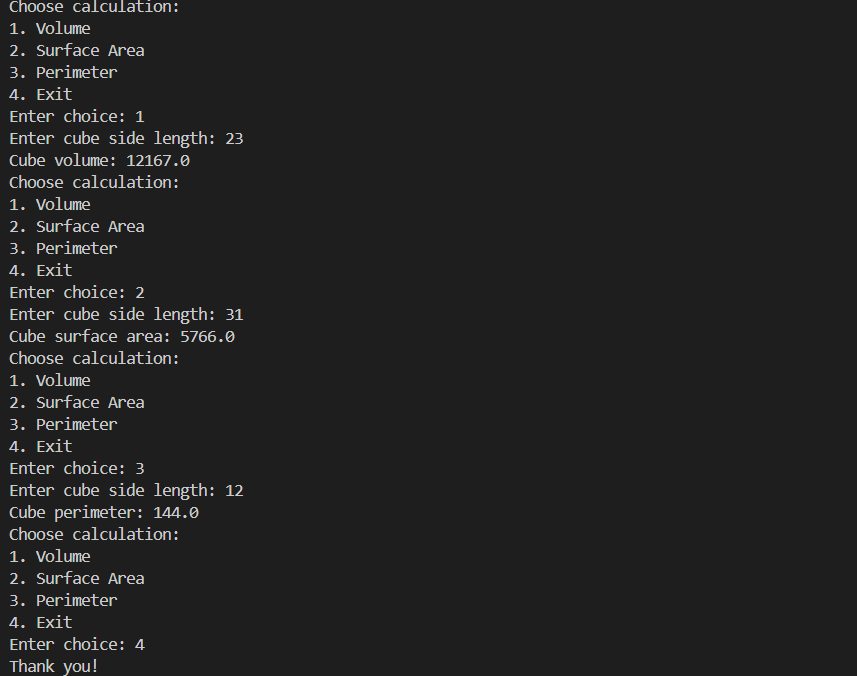

|  | Algorithm and Data Structure |
|--|--|
| NIM |  244107020075|
| Nama |  Keenan Raditya Prasaja |
| Kelas | TI - 1I |
| Repository | [link] ([https://github.com/jti-polinema/-01-contoh-laporan-react](https://github.com/kentung0201/Jobsheet1-daspro-pakimam.git)) |

# Labs #1 Programming Fundamentals Review

## 1.1 pairing car code

The solution is implemented in PlatNomor.java, and below is screenshot of the result.

**Brief explanation:** There are 6 main step: 
1. Define Plate Codes and Cities
2. Get User Input
3. Search for a Match
4. Print City Name
5. Handle Invalid Input
6. Close Scanner

## 1.2 equation for cube

The solution is implemented in kubus.java, and below is screenshot of the result.

**Brief explanation:** There are 8 main step: 
1. Import Scanner 
2. Show Menu  
3. Get User Choice  
4. Check Exit Condition 
5. Get Side Length
6. Calculate & Display Result 
7. Handle Invalid Input  
8. Close Scanner

## 1.3 display course

The solution is implemented in courseSchedule.java, and below is screenshot of the result.

**Brief explanation:** There are 6 main step: 
1. Initialize Scanner 
2. Get Number of Courses  
3. Store Course Details  
4. Display Menu
5. Handle User Choice 
   - Display All Courses  
   - Display Courses by Day  
   - Display Courses by Semester  
   - Search for a Course  
   - Exit Program  
6. Close Scanner
